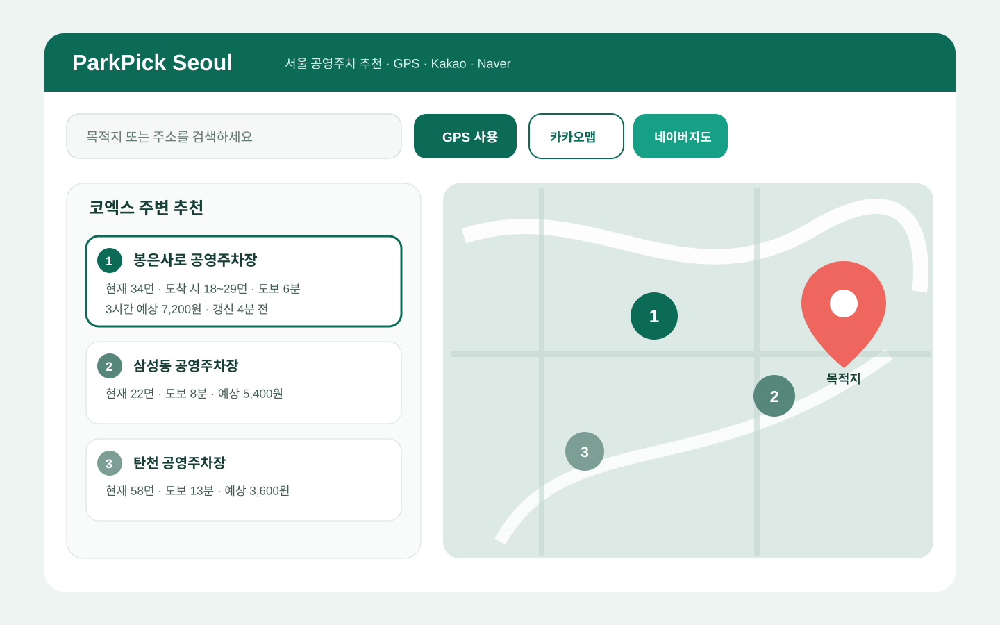

# ParkPick Seoul

GPS 출발지와 목적지를 기준으로 서울 공영주차장의 빈자리, 예상요금, 자동차·도보 이동시간과 만차 위험을 비교하고 **카카오맵·네이버지도 중 원하는 지도와 네비 앱으로 연결하는 모바일 우선 PWA**입니다.

> 지금 출발하면 어디에 주차하는 것이 가장 유리한가?



## 구현된 기본 기능

- 사용자가 버튼을 누른 뒤에만 GPS 권한 요청
- 권한 허용·거부·시간초과·미지원·비보안 연결 상태 처리
- GPS 없이 출발지를 직접 검색하는 폴백
- 목적지 검색과 API 키가 없는 데모 검색
- 서울시 `GetParkingInfo` 어댑터와 데모 데이터 폴백
- 체류시간 기준 예상 주차요금
- 빈자리·도보·요금·자동차 이동·데이터 신뢰도 추천점수
- 균형·저렴·가까움·주차확실 모드
- 추천 1~3순위와 대체 주차장
- **웹앱 지도: 카카오맵 / 네이버 Web Dynamic Map / 키 없는 미리보기 전환**
- **외부 길안내: 카카오내비 / 네이버지도 내비게이션 URL Scheme**
- Android 네이버지도 Intent, iOS 앱 미설치 스토어 폴백
- PWA manifest, 홈 화면 설치, 서비스워커, 오프라인 화면
- 모바일 하단 고정 출발 버튼
- 단위 테스트와 Vercel Git 기반 CI/CD

현재 버전은 기본 틀입니다. 과거 주차 스냅샷 DB는 아직 저장하지 않으므로 도착시점 예상은 현재 가용면, 최근 추세가 있을 경우의 증감, 데이터 지연을 이용한 범위입니다. 요일·시간대 패턴 예측은 다음 단계입니다.

## 실행

```bash
npm install
cp .env.example .env.local
npm run dev:https
```

API 키가 없어도 데모 모드로 모든 입력·추천·지도 미리보기 흐름을 확인할 수 있습니다.

## 환경변수

| 변수 | 용도 |
|---|---|
| `SEOUL_OPEN_API_KEY` | 서울시 시영주차장 실시간 데이터 |
| `KAKAO_REST_API_KEY` | 카카오 장소검색 |
| `KAKAO_MOBILITY_REST_API_KEY` | 자동차 다중 목적지 경로시간 |
| `NEXT_PUBLIC_KAKAO_MAP_JAVASCRIPT_KEY` | 웹앱 안의 카카오맵 |
| `NEXT_PUBLIC_KAKAO_JAVASCRIPT_KEY` | 카카오내비 JavaScript SDK |
| `NEXT_PUBLIC_NAVER_MAP_NCP_KEY_ID` | 웹앱 안의 네이버 Web Dynamic Map |
| `NEXT_PUBLIC_NAVER_APP_NAME` | 네이버지도 앱 URL Scheme 필수 `appname`; 배포 웹 URL 권장 |
| `NEXT_PUBLIC_SITE_URL` | 배포 URL |
| `NEXT_PUBLIC_GITHUB_REPO_URL` | 헤더 GitHub 링크 |

네이버 지도 JavaScript API의 현재 로딩 파라미터는 기존 `ncpClientId`가 아니라 `ncpKeyId`입니다. 카카오와 네이버 콘솔 양쪽에 `localhost`와 실제 배포 도메인을 등록해야 합니다.

## 지도와 네비 역할

```text
추천 엔진
  ├─ 서울시 주차정보
  ├─ 요금 계산
  ├─ 빈자리·신뢰도 점수
  └─ 상위 3곳
       │
       ├─ 카카오맵에서 보기 → 카카오내비 출발
       └─ 네이버지도에서 보기 → 네이버지도 내비 출발
```

지도 공급자를 바꿔도 추천순위는 바뀌지 않습니다. 지도는 결과 표시와 외부 길안내를 담당하고, 추천은 동일한 주차 데이터와 점수식으로 계산합니다.

## 추천점수

| 항목 | 균형 모드 |
|---|---:|
| 도착시점 빈자리 가능성 | 35% |
| 목적지 도보편의 | 25% |
| 예상 주차요금 | 20% |
| 자동차 우회시간 | 15% |
| 데이터 최신성 | 5% |

## 구조

```text
app/api/                   장소검색·추천 Route Handler
components/MapPanel.tsx    Kakao/Naver/preview 지도 Provider
components/NavigationButtons.tsx  두 네비 앱 handoff
hooks/use-geolocation.ts   GPS 권한·오류 상태
lib/api/                   서울시·카카오 외부 API 어댑터
lib/domain/                거리·요금·추천 순수 로직
public/sw.js               최소 PWA 서비스워커
SPEC.md                    상세 제품·기술 명세
```

## 참고한 공개 프로젝트

직접 코드를 복사하지 않고 구조적 관례를 참고했습니다.

- `shadcn-ui/ui`: 작은 UI primitive와 접근성 중심 컴포넌트 경계
- `TanStack/query`: 서버상태와 화면상태 분리 원칙
- `serwist/serwist`: PWA·서비스워커 책임 분리
- `vercel/next.js`: App Router, Route Handler, manifest 패턴

현재 기본 틀은 의존성을 작게 유지하기 위해 위 라이브러리들을 직접 설치하지 않고 책임 분리만 적용했습니다.

## CI/CD: GitHub Actions 대신 Vercel

이 저장소는 GitHub Actions를 사용하지 않습니다. Vercel에 GitHub 저장소를 한 번 연결하면 다음 흐름으로 동작합니다.

```text
브랜치 push / Pull Request
→ Vercel Preview Build
→ ESLint
→ TypeScript typecheck
→ Vitest
→ Next.js production build
→ 성공한 경우에만 Preview URL 생성

main push / merge
→ 동일 검증
→ Production 배포
```

Vercel이 실행하는 명령은 `npm run vercel-build`이며, 내부적으로 `lint → typecheck → test → next build`를 순서대로 수행합니다. 따라서 GitHub Actions 사용량을 소비하지 않으면서 빌드 실패를 배포 차단 조건으로 사용할 수 있습니다.

로컬에서 같은 검증을 실행하려면 다음 명령을 사용합니다.

```bash
npm run verify
```

## 검증

```bash
npm run typecheck
npm test
npm run build
```

## 다음 단계

- Supabase/Postgres에 5분 주차 스냅샷 적재
- 요일 × 10분 시간대 패턴과 백테스트
- Naver Directions 5/15를 선택형 자동차 경로 Provider로 추가
- 실제 주차 성공·만차 피드백
- 전기차·장애인 주차면 필터

## 라이선스

MIT
